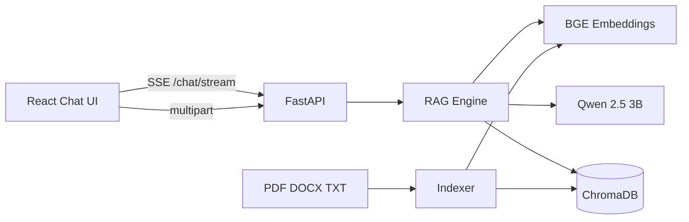

# Meraki SD-WAN Knowledge Agent

Offline **RAG** assistant for Cisco Meraki SD-WAN fulfillment knowledge.  
Local embeddings + ChromaDB + Qwen, with a ChatGPT-style UI, confidence-scored sources, document upload, and multi-turn memory.

   

---

## Features

| Feature | Description |
|--------|-------------|
| **Chat UI** | Conversation layout with streaming answers |
| **Hybrid search** | Dense (Chroma) + BM25 fused with Reciprocal Rank Fusion |
| **Grounded answers** | Strict prompt — refuses when context is insufficient |
| **Source cards** | Collapsed cards with chunk #, confidence, expand to full text |
| **Confidence** | 0–100 score (green / yellow / orange / red) |
| **Answer meta** | Retrieved chunks, embedding model, LLM, generation time |
| **Upload** | Staged pipeline: upload → read → chunk → embed → save |
| **Knowledge base** | Multi-doc panel with delete + re-index |
| **Memory** | Follow-ups like “what happens after that?” use chat history |
| **Smart chunking** | Preserves headings and numbered steps |
| **Dark mode** | Theme toggle with local preference |
| **Docker** | Compose stack for backend + nginx frontend |

---

## Architecture



```
backend/
├── app.py              # FastAPI entry + lifespan
├── config.py           # env-driven settings
├── schemas.py
├── api/
│   ├── routes.py       # /chat, /chat/stream, /documents/*
│   └── deps.py
└── services/
    ├── rag.py
    ├── vector_db.py
    ├── embeddings.py
    ├── parser.py
    ├── chunker.py
    └── indexer.py
```

---

## Quick start (local)

### Prerequisites

- Python **3.11+**
- Node **20+**
- Local **Qwen2.5-3B-Instruct** weights (or set `LLM_PATH`)
- GPU recommended (CPU works, slower)

### 1. Backend

```powershell
cd D:\Projects\knowledge-agent
python -m venv venv
.\venv\Scripts\Activate.ps1
pip install -r requirements.txt

copy .env.example .env
# Edit LLM_PATH in .env to your model folder

# Index the seed Meraki document (first time / after chunker changes)
python scripts\reindex.py

cd backend
uvicorn app:app --reload --host 127.0.0.1 --port 8000
```

### 2. Frontend

```powershell
cd frontend
npm install
npm run dev
```

Open **http://localhost:5173**

### Sample questions

- What happens after BPMS triggers Meraki API?
- What happens after that? *(follow-up — uses memory)*
- How is order status updated?

---

## API

| Method | Path | Description |
|--------|------|-------------|
| `GET` | `/health` | Status |
| `POST` | `/chat` | Non-streaming chat |
| `POST` | `/chat/stream` | SSE: `sources` → `token*` → `done` |
| `POST` | `/documents/upload` | Multipart file upload + index (JSON) |
| `POST` | `/documents/upload/stream` | Same pipeline as SSE stages |
| `GET` | `/documents` | List indexed sources |
| `DELETE` | `/documents/{source}` | Remove a document’s chunks |
| `POST` | `/documents/{source}/reindex` | Re-chunk + re-embed from disk |

### Chat body

```json
{
  "question": "What happens after that?",
  "history": [
    { "role": "user", "content": "What happens after BPMS triggers Meraki API?" },
    { "role": "assistant", "content": "..." }
  ]
}
```

### Source object

```json
{
  "source": "Meraki_SDWAN_Fulfillment_Knowledge_Doc.docx",
  "chunk_index": 2,
  "preview": "BPMS triggers the Meraki API vendor automation service via webhook...",
  "confidence": 96,
  "distance": 0.04,
  "content": "full chunk text…",
  "heading": "Vendor Automation",
  "retrieval": "hybrid"
}
```

**Confidence** = `max(0, min(100, int((1 - distance) * 100)))` for dense hits.

**Hybrid retrieval**: dense Chroma top‑N + BM25 top‑N → Reciprocal Rank Fusion (`RRF_K=60`).

---

## Docker

1. Copy `.env.example` → `.env` and set model host path:

```env
LLM_HOST_PATH=D:/Programe_Data/models/Qwen2.5-3B-Instruct
LLM_PATH=/models/Qwen2.5-3B-Instruct
```

2. Run:

```powershell
docker compose up --build
```

- UI: http://localhost:3000  
- API: http://localhost:8000  

> Models are **volume-mounted**, not baked into the image (keeps images small).

---

## Configuration

See [`.env.example`](.env.example). Important keys:

| Variable | Default | Purpose |
|----------|---------|---------|
| `LLM_PATH` | host-specific | Qwen model directory |
| `EMBEDDING_MODEL` | `BAAI/bge-small-en-v1.5` | Sentence embeddings |
| `TOP_K` | `5` | Retrieved chunks |
| `CHUNK_SIZE` / `CHUNK_OVERLAP` | `120` / `30` | Section packing (words) |
| `MAX_HISTORY_TURNS` | `6` | Conversation memory depth |
| `MAX_UPLOAD_MB` | `15` | Upload size limit |

---

## Development notes

### Reindex after chunker/parser changes

```powershell
python scripts\reindex.py
# or a custom file:
python scripts\reindex.py path\to\doc.pdf
```

### Unit tests (no GPU)

```powershell
python backend\tests\test_chunker_unit.py
```

### Design choices

- **Client-owned history** — stateless API, easy demos
- **SSE streaming** — progressive UX with local transformers streamer
- **Section-aware chunks** — better for process docs with numbered steps
- **Multi-document Chroma** — upload without wiping the whole KB

---

## Limitations

- Quality depends on the local 3B model and the documents you index
- First load downloads the embedding model and loads Qwen into VRAM/RAM
- No authentication (intended for local / portfolio demos)
- Cosine space is set on new collections; reindex if you upgraded from an older DB layout

---

## License

Personal / portfolio project. Meraki and Cisco are trademarks of their respective owners.
